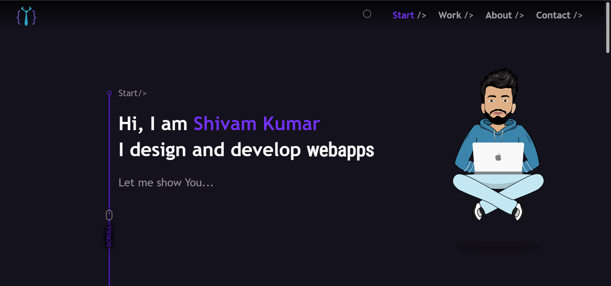

<h1><a href="https://wandering-sage.github.io/">Portfolio</a></h1>

  <strong>My vanilla JavaScript portfolio website</strong>
   
  Made with ❤︎ by
    <a href="https://github.com/wandering-sage">Shivam Kumar</a>
  

## Project in Action

<h3><a href="https://wandering-sage.github.io/">Click here to visit Live Project</a></h3>

## Features

- It has a cool page loader, people tends to wait more for a page with loader.
- Implemented a small cursor that follows mouse with a delay and it gets bigger when there is a clickable object.
- The NavBar has smooth scroll effect, when you click a section it will scroll to that section smoothly.
- When a project is clicked, it creates a new state on hystory so that user can go back to main page using browser's back key. This helps in creating the illusion that projects are opened as a new page but they are just a bunch of divs.
- Made 3D project cards that updates accourding to cursor position.
- Every project has two links i.e. live project and view source code, you can hover over moniters to find them.

